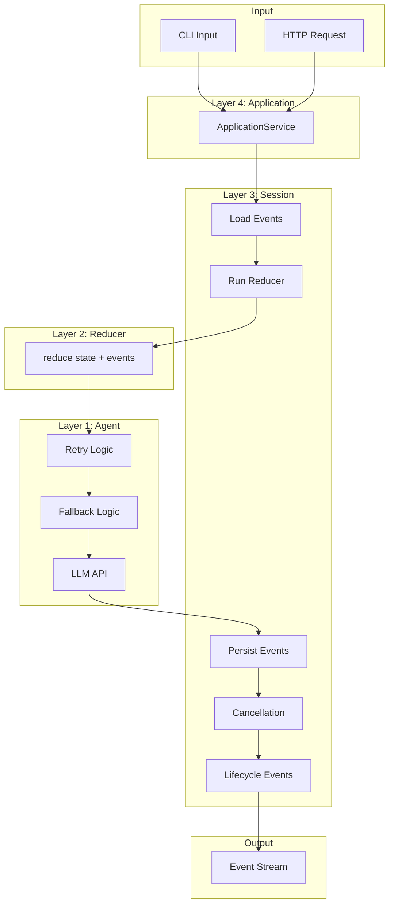
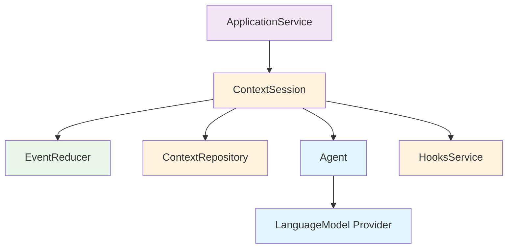

# Architecture Overview

## Core Concepts

AI agents of arbitrary complexity can be represented as a **pure function** that takes a context and transforms it—via one or more LLM requests—into a new context.

```
                    ┌─────────────────────────────────────┐
                    │           Agent Function            │
   Context In ─────▶│  (events) → LLM → (more events)    │─────▶ Context Out
                    └─────────────────────────────────────┘
```

### Context = Named Event Log

A **context** is simply a named, append-only log of events. The name is just a string identifier.

```
Context "chat-123"
┌──────────────────────────────────────────────────────────────┐
│  Event Log (immutable, append-only)                          │
│  ┌──────────┐ ┌──────────┐ ┌──────────┐ ┌──────────┐        │
│  │ System   │ │ User     │ │ Assistant│ │ User     │ ...    │
│  │ Prompt   │ │ Message  │ │ Message  │ │ Message  │        │
│  └──────────┘ └──────────┘ └──────────┘ └──────────┘        │
│       ↓            ↓            ↓            ↓               │
│  ─────────────────────────────────────────────────────────── │
│                         Reducer                              │
│  ─────────────────────────────────────────────────────────── │
│       ↓                                                      │
│  ┌───────────────────────────────────────────────────────┐   │
│  │              ReducedContext                           │   │
│  │  • messages: Prompt.Message[] (from @effect/ai)       │   │
│  │  • config: {provider, timeout, ...}                   │   │
│  └───────────────────────────────────────────────────────┘   │
└──────────────────────────────────────────────────────────────┘
```

### Event Sourcing

We represent context as **event-sourced state**:
- The event log is the source of truth (immutable, append-only)
- A **reducer** folds events into a working data structure (`ReducedContext`)
- `ReducedContext` controls the agent turn (messages, provider, timeout)

### External Interface

A context has exactly one interface: **events in, events out**.

```
                 ┌─────────────────────┐
     Events ────▶│      Context        │────▶ Events
                 │  (name → event[])   │
                 └─────────────────────┘

  Examples:
  • UserMessageEvent           • AssistantMessageEvent
  • SetLlmProviderConfigEvent   • TextDeltaEvent
  • FileAttachmentEvent        • AgentTurnCompletedEvent
```

What might be called an "agent" in other systems is simply a context here—a named collection of events that gets reduced and fed to an LLM.

---

## The Onion Model

The architecture follows an "onion" or "layered" pattern where each layer wraps the one inside it, adding specific responsibilities. Dependencies flow inward—outer layers depend on inner layers, never the reverse.

```
┌─────────────────────────────────────────────────────────────────────┐
│                     4. Application Layer                            │
│                     (CLI, HTTP API)                                 │
│  ┌───────────────────────────────────────────────────────────────┐  │
│  │             3. Session Layer                                   │  │
│  │             (Load/Persist, Lifecycle, Cancellation)            │  │
│  │  ┌─────────────────────────────────────────────────────────┐  │  │
│  │  │          2. Reducer Layer                                │  │  │
│  │  │          (State + Events → State)                        │  │  │
│  │  │  ┌─────────────────────────────────────────────────┐    │  │  │
│  │  │  │       1. Agent Layer                             │    │  │  │
│  │  │  │       (Retry, Fallback, Parallel)                │    │  │  │
│  │  │  └─────────────────────────────────────────────────┘    │  │  │
│  │  └─────────────────────────────────────────────────────────┘  │  │
│  └───────────────────────────────────────────────────────────────┘  │
└─────────────────────────────────────────────────────────────────────┘
```

## Layer Responsibilities

### Layer 1: Agent (Innermost)

**Responsibility**: Take agent turns with retry, fallback, and parallel execution support.

**Input**: `ReducedContext` (everything needed for the turn)
**Output**: `Stream<ContextEvent>` (TextDelta events during streaming, AssistantMessage at end)

**Key Capabilities**:
- Retry with Effect Schedule (exponential backoff, etc.)
- Fallback to alternate provider on failure
- Parallel requests (e.g., content + injection detection)
- Timeout handling

**Does NOT know about**:
- Where events came from
- Persistence
- Session lifecycle

### Layer 2: Reducer

**Responsibility**: Apply new events to the current reduced state, producing a new reduced state.

This is a true functional reducer in the FP sense:

```typescript
// The reducer service
readonly reduce: (
  current: ReducedContext,
  newEvents: readonly ContextEvent[]
) => Effect.Effect<ReducedContext, ReducerError>

// Internally uses a pure step function for each event
type ReducerStep = (accumulator: ReducedContext, event: ContextEvent) => ReducedContext

// Implementation: fold new events over current state
const reduce = (current, newEvents) =>
  newEvents.reduce(reducerStep, current)
```

**Input**: `(current: ReducedContext, newEvents: readonly ContextEvent[])`
**Output**: `ReducedContext` (updated state with new events applied)

**Key Capabilities**:
- Apply each new event to the current accumulator
- Build up messages from content events (using `@effect/ai` Prompt.Message)
- Update configuration from config events
- Validate the final reduced state

**Does NOT know about**:
- Where events are stored
- How agent turns are executed
- Session lifecycle

### Layer 3: Session

**Responsibility**: Manage a context's lifecycle—loading events, running reducers, persisting new events, handling cancellation.

Session handles both state management and turn interruption (no separate Handler layer).

**Input**: Context name + new events
**Output**: Continuous `Stream<ContextEvent>` (all output events including lifecycle)

**Key Interface**:
```typescript
readonly addEvent: (event: ContextEvent) => Effect.Effect<void, SessionError>
readonly events: Stream.Stream<ContextEvent, SessionError>
```

`addEvent` returns void (fire and forget). `events` is a separate continuous stream that emits all events until session ends.

**Key Capabilities**:
- Load events from storage
- Emit `SessionStartedEvent` on initialization
- Persist events immediately as they arrive
- Emit lifecycle events (AgentTurnStarted, AgentTurnCompleted)
- Cancel in-flight agent turn on new user input
- Emit `AgentTurnInterruptedEvent` with partial response
- Emit `SessionEndedEvent` on cleanup

**Does NOT know about**:
- External interface (CLI/HTTP)
- Display formatting

### Layer 4: Application (Outermost)

**Responsibility**: Provide a clean interface for external consumers (CLI, HTTP API). Route by context name.

**Key Interface**:
```typescript
readonly addEvent: (contextName: ContextName, event: ContextEvent) => Effect.Effect<void, SessionError>
readonly eventStream: (contextName: ContextName) => Stream.Stream<ContextEvent, SessionError>
readonly shutdown: () => Effect.Effect<void>
```

**Key Capabilities**:
- Create sessions on demand (per context name)
- Route events to correct session
- Graceful shutdown of all sessions
- Clean interface for CLI and HTTP

---

## Data Flow



---

## Event Flow Example

### Successful Turn

```
1. User sends "Hello"
   → UserMessageEvent created

2. Layer 4 (Application)
   → Routes to session for context name

3. Layer 3 (Session)
   → UserMessageEvent persisted
   → AgentTurnStartedEvent emitted + persisted
   → Events passed to reducer

4. Layer 2 (Reducer)
   → New event applied to current ReducedContext
   → Updated messages: [Prompt.userMessage({ content: "Hello" })]
   → Config: {provider: "openai", timeout: 30000}

5. Layer 1 (Agent)
   → takeTurn called with ReducedContext
   → Request made to OpenAI
   → TextDeltaEvent streamed
   → AssistantMessageEvent created on completion

6. Layer 3 (Session)
   → AssistantMessageEvent persisted
   → AgentTurnCompletedEvent emitted + persisted

7. Output
   → Stream contains: AgentTurnStarted, TextDelta*, AssistantMessage, AgentTurnCompleted
```

### Interrupted Turn

```
1. User sends "Hello"
   → Turn starts, TextDelta events streaming

2. User sends "Actually, goodbye" (while streaming)

3. Layer 3 (Session)
   → Detects new UserMessageEvent
   → Interrupts in-flight fiber
   → Captures partial response ("Hi there! How can I h...")
   → AgentTurnInterruptedEvent emitted with partial response
   → New UserMessageEvent persisted
   → New turn starts...
```

---

## Service Dependencies



---

## Layer Composition (Effect Layers)

```typescript
// Layer 1: Agent
const agentLayer = Agent.layer.pipe(
  Layer.provide(LanguageModel.layer)
)

// Layer 2: Reducer
const reducerLayer = EventReducer.layer

// Layer 3: Session
const sessionLayer = ContextSession.layer.pipe(
  Layer.provide(reducerLayer),
  Layer.provide(agentLayer),
  Layer.provide(ContextRepository.layer),
  Layer.provide(HooksService.layer)
)

// Layer 4: Application
const applicationLayer = ApplicationService.layer.pipe(
  Layer.provide(sessionLayer)
)

// Full app
const appLayer = applicationLayer.pipe(
  Layer.provideMerge(AppConfig.layer),
  Layer.provideMerge(BunContext.layer)
)
```

---

## Key Design Principles

### 1. Service-First Design

Define service interfaces before implementations:

```typescript
// Interface first
class Agent extends Context.Tag("@app/Agent")<
  Agent,
  { readonly takeTurn: (ctx: ReducedContext) => Stream.Stream<ContextEvent, AgentError> }
>() {}

// Implementation later
Agent.layer = Layer.effect(Agent, /* ... */)
Agent.testLayer = Layer.sync(Agent, /* mock */)
```

### 2. Stateless Inner Layers

Inner layers (1, 2) are stateless—they receive everything they need as parameters. Outer layers (3, 4) manage state.

### 3. Decoupled Input and Output

`addEvent` returns void. `events` is a separate continuous stream. This allows:
- Fire-and-forget input
- Multiple subscribers to output
- Clean cancellation semantics

### 4. Events as Source of Truth

Everything is an event. Configuration changes are events. Lifecycle markers are events. This enables:
- Full audit trail
- Replay capability (future)
- Debugging via event log

### 5. Hooks at Layer Boundaries

Extensibility via HooksService:
- `beforeTurn` - Transform context before agent turn
- `afterTurn` - Transform events after agent turn (can expand 1→N)
- `onEvent` - Observe all events (for logging, metrics)

### 6. Use Effect Ecosystem

- `@effect/ai` Prompt.Message for LLM messages (not custom types)
- Effect Schedule for retry configuration (not custom RetryConfig)
- Schema with `...BaseEventFields` spread for shared event fields
