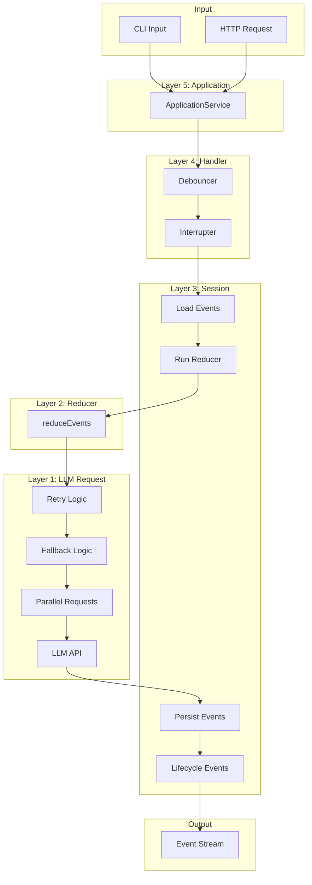
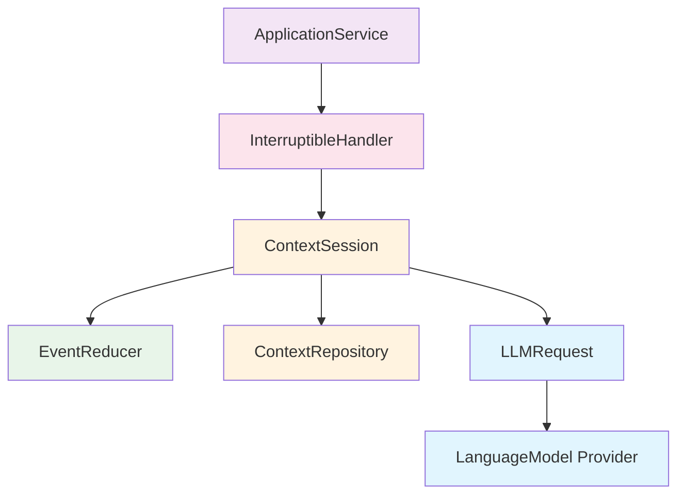

# Architecture Overview

## Core Concepts

AI agents of arbitrary complexity can be represented as a **pure function** that takes a context and transforms it—via one or more LLM requests—into a new context.

```
                    ┌─────────────────────────────────────┐
                    │           Agent Function            │
   Context In ─────▶│  (events) → LLM → (more events)    │─────▶ Context Out
                    └─────────────────────────────────────┘
```

### Context = Named Event Log

A **context** is simply a named, append-only log of events. The name is just a string identifier.

```
Context "chat-123"
┌──────────────────────────────────────────────────────────────┐
│  Event Log (immutable, append-only)                          │
│  ┌──────────┐ ┌──────────┐ ┌──────────┐ ┌──────────┐        │
│  │ System   │ │ User     │ │ Assistant│ │ User     │ ...    │
│  │ Prompt   │ │ Message  │ │ Message  │ │ Message  │        │
│  └──────────┘ └──────────┘ └──────────┘ └──────────┘        │
│       ↓            ↓            ↓            ↓               │
│  ─────────────────────────────────────────────────────────── │
│                         Reducer                              │
│  ─────────────────────────────────────────────────────────── │
│       ↓                                                      │
│  ┌───────────────────────────────────────────────────────┐   │
│  │              ReducedContext                           │   │
│  │  • messages: [{role, content}, ...]                   │   │
│  │  • config: {provider, retry, timeout, ...}            │   │
│  └───────────────────────────────────────────────────────┘   │
└──────────────────────────────────────────────────────────────┘
```

### Event Sourcing

We represent context as **event-sourced state**:
- The event log is the source of truth (immutable, append-only)
- A **reducer** folds events into a working data structure (`ReducedContext`)
- `ReducedContext` controls the LLM request (messages, provider, retry config)

### External Interface

A context has exactly one interface: **events in, events out**.

```
                 ┌─────────────────────┐
  InputEvents ──▶│      Context        │──▶ OutputEvents
                 │  (name → event[])   │
                 └─────────────────────┘

  Input examples:              Output examples:
  • UserMessageEvent           • TextDeltaEvent (ephemeral)
  • SetProviderConfigEvent     • AssistantMessageEvent
  • FileAttachmentEvent        • LLMRequestCompletedEvent
```

What might be called an "agent" in other systems is simply a context here—a named collection of events that gets reduced and fed to an LLM.

---

## The Onion Model

The architecture follows an "onion" or "layered" pattern where each layer wraps the one inside it, adding specific responsibilities. Dependencies flow inward—outer layers depend on inner layers, never the reverse.

```
┌─────────────────────────────────────────────────────────────────────┐
│                     5. Application Layer                            │
│                     (CLI, HTTP API)                                 │
│  ┌───────────────────────────────────────────────────────────────┐  │
│  │                4. Handler Layer                                │  │
│  │                (Interruption, Debouncing)                      │  │
│  │  ┌─────────────────────────────────────────────────────────┐  │  │
│  │  │             3. Session Layer                             │  │  │
│  │  │             (Load/Persist, Lifecycle)                    │  │  │
│  │  │  ┌─────────────────────────────────────────────────┐    │  │  │
│  │  │  │          2. Reducer Layer                        │    │  │  │
│  │  │  │          (Events → ReducedContext)               │    │  │  │
│  │  │  │  ┌─────────────────────────────────────────┐    │    │  │  │
│  │  │  │  │       1. LLM Request Layer               │    │    │  │  │
│  │  │  │  │       (Retry, Fallback, Parallel)        │    │    │  │  │
│  │  │  │  └─────────────────────────────────────────┘    │    │  │  │
│  │  │  └─────────────────────────────────────────────────┘    │  │  │
│  │  └─────────────────────────────────────────────────────────┘  │  │
│  └───────────────────────────────────────────────────────────────┘  │
└─────────────────────────────────────────────────────────────────────┘
```

## Layer Responsibilities

### Layer 1: LLM Request (Innermost)

**Responsibility**: Make LLM API calls with retry, fallback, and parallel execution support.

**Input**: `ReducedContext` (everything needed for the request)
**Output**: `Stream<ContextEvent>` (TextDelta events during streaming, AssistantMessage at end)

**Key Capabilities**:
- Retry with configurable schedule (exponential backoff, etc.)
- Fallback to alternate provider on failure
- Parallel requests (e.g., content + injection detection)
- Timeout handling

**Does NOT know about**:
- Where events came from
- Persistence
- Session lifecycle

### Layer 2: Reducer

**Responsibility**: Fold events into a `ReducedContext` using a pure reducer function.

This is a true functional reducer in the FP sense:

```typescript
// Pure reducer signature
type EventReducer = (accumulator: ReducedContext, event: PersistedEvent) => ReducedContext

// Usage: fold over all events
const reduce = (events: readonly PersistedEvent[]): ReducedContext =>
  events.reduce(eventReducer, initialReducedContext)
```

**Input**: `(accumulator: ReducedContext, event: PersistedEvent)`
**Output**: `ReducedContext` (new accumulator)

**Key Capabilities**:
- Apply each event to the accumulator state
- Build up messages from content events
- Update configuration from config events
- Validate the final reduced state

**Does NOT know about**:
- Where events are stored
- How LLM requests are made
- Session lifecycle

### Layer 3: Session

**Responsibility**: Manage a context's lifecycle—loading events, running reducers, persisting new events.

**Input**: Context name + new events
**Output**: `Stream<ContextEvent>` (all output events including lifecycle)

**Key Capabilities**:
- Load events from storage
- Emit `SessionStartedEvent` on initialization
- Persist events immediately as they arrive
- Emit lifecycle events (RequestStarted, RequestCompleted)
- Emit `SessionEndedEvent` on cleanup

**Does NOT know about**:
- Request interruption
- Debouncing
- External interface (CLI/HTTP)

### Layer 4: Handler

**Responsibility**: Handle concurrent requests—debounce rapid input, cancel in-flight requests on new input.

**Input**: Stream of individual events
**Output**: Stream of output events

**Key Capabilities**:
- "Wait for quiet" debouncing (configurable delay)
- Cancel in-flight LLM request on new user input
- Emit `LLMRequestInterruptedEvent` with partial response
- Manage request state (accumulate partial responses)

**Does NOT know about**:
- How input arrives (CLI vs HTTP)
- Display formatting
- External lifecycle

### Layer 5: Application (Outermost)

**Responsibility**: Provide a clean interface for external consumers (CLI, HTTP API).

**Input**: User commands (start session, send message, etc.)
**Output**: Event stream for display/serialization

**Key Capabilities**:
- Initialize sessions on startup
- Route user input to handler
- Format output for display
- Clean shutdown with `SessionEndedEvent`

---

## Data Flow



---

## Event Flow Example

### Successful Request

```
1. User sends "Hello"
   → UserMessageEvent created

2. Layer 4 (Handler)
   → Debounce timer starts (10ms)
   → Timer expires, no more input

3. Layer 3 (Session)
   → UserMessageEvent persisted
   → LLMRequestStartedEvent emitted + persisted
   → Events passed to reducer

4. Layer 2 (Reducer)
   → All events reduced to ReducedContext
   → Messages: [{role: "user", content: "Hello"}]
   → Config: {provider: "openai", retry: {maxRetries: 3, ...}}

5. Layer 1 (LLM Request)
   → Request made to OpenAI
   → TextDeltaEvent streamed (ephemeral, not persisted)
   → AssistantMessageEvent created on completion

6. Layer 3 (Session)
   → AssistantMessageEvent persisted
   → LLMRequestCompletedEvent emitted + persisted

7. Output
   → Stream contains: LLMRequestStarted, TextDelta*, AssistantMessage, LLMRequestCompleted
```

### Interrupted Request

```
1. User sends "Hello"
   → Request starts, TextDelta events streaming

2. User sends "Actually, goodbye" (while streaming)
   → Layer 4 detects new UserMessageEvent

3. Layer 4 (Handler)
   → Cancels in-flight fiber
   → Captures partial response ("Hi there! How can I h...")
   → LLMRequestInterruptedEvent emitted with partial response

4. Layer 4 (Handler)
   → Debounce timer starts for new message
   → Timer expires

5. Layer 3 (Session)
   → New UserMessageEvent persisted
   → New LLMRequestStartedEvent emitted
   → Process continues...
```

---

## Service Dependencies



---

## Layer Composition (Effect Layers)

```typescript
// Layer 1: LLM Request
const llmRequestLayer = LLMRequest.layer.pipe(
  Layer.provide(OpenAiLanguageModel.layer)
)

// Layer 2: Reducer (pure function or service)
const reducerLayer = EventReducer.layer

// Layer 3: Session
const sessionLayer = ContextSession.layer.pipe(
  Layer.provide(reducerLayer),
  Layer.provide(llmRequestLayer),
  Layer.provide(ContextRepository.layer)
)

// Layer 4: Handler
const handlerLayer = InterruptibleHandler.layer.pipe(
  Layer.provide(sessionLayer)
)

// Layer 5: Application
const applicationLayer = ApplicationService.layer.pipe(
  Layer.provide(handlerLayer)
)

// Full app
const appLayer = applicationLayer.pipe(
  Layer.provideMerge(HooksService.layer),
  Layer.provideMerge(AppConfig.layer),
  Layer.provideMerge(BunContext.layer)
)
```

---

## Key Design Principles

### 1. Service-First Design

Define service interfaces before implementations:

```typescript
// Interface first
class LLMRequest extends Context.Tag("@app/LLMRequest")<
  LLMRequest,
  { readonly stream: (ctx: ReducedContext) => Stream.Stream<ContextEvent, LLMError> }
>() {}

// Implementation later
LLMRequest.layer = Layer.effect(LLMRequest, /* ... */)
LLMRequest.testLayer = Layer.sync(LLMRequest, /* mock */)
```

### 2. Stateless Inner Layers

Inner layers (1, 2) are stateless—they receive everything they need as parameters. Outer layers (3, 4, 5) manage state.

### 3. Stream-First Response

LLM responses are always streams, even for non-streaming use cases. This enables:
- Progressive display (TextDelta)
- Cancellation mid-stream
- Consistent API

### 4. Events as Source of Truth

Everything is an event. Configuration changes are events. Lifecycle markers are events. This enables:
- Full audit trail
- Replay capability (future)
- Debugging via event log

### 5. Hooks at Layer Boundaries

Extensibility via hooks at each layer boundary:
- Before/after LLM request (Layer 1)
- Before/after reduction (Layer 2)
- On event persist (Layer 3)
- On input/output (Layer 4)
